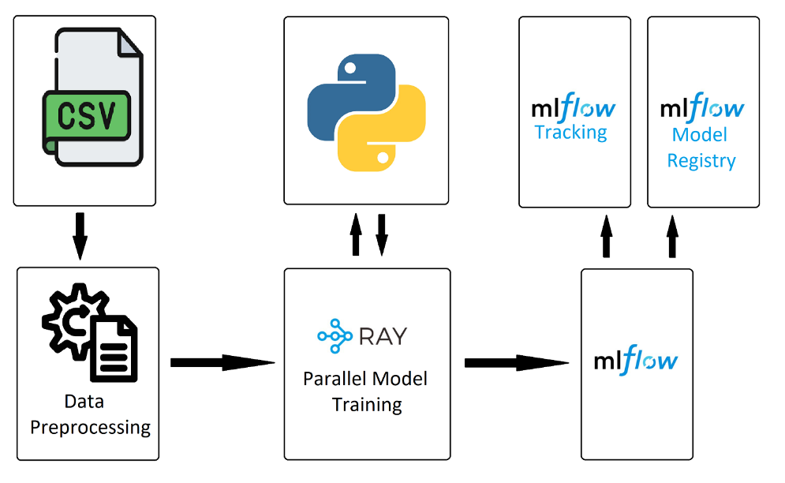

# Ray + MLflow

**Authors:**  
Szymon Woźniak, Kacper Kotkiewicz, Aleksandra Poskróbek

---

## Objective

The objective of this project is to build a system for **Credit Risk analysis** based on the [Statlog (German Credit Data)](https://archive.ics.uci.edu/dataset/144/statlog+german+credit+data). This dataset classifies individuals described by various attributes as either good or bad credit risks.

The main goal is to develop a machine learning pipeline that can effectively predict the credit risk of new applicants, helping banks and financial institutions make informed lending decisions.

This project uses:
- **Ray** for parallel and distributed execution of ML workflows, enabling efficient and scalable model training.
- **MLflow** to track and manage experiments, logging parameters, metrics, and models for reproducibility and easy comparison.

---

## Main Problems to Solve

- Efficient preprocessing of data from German Credit Data
- Implement scalable and **parallel** model training using Ray
- Manage and track multiple ML experiments (parameters, metrics, models) with MLflow
- Provide a lightweight, local solution demonstrating scalable computation (Ray) and experiment management (MLflow)

---

## Architecture Diagram



---

## Planned Tests

### Details of the Experiment
- Compare performance (accuracy, F1-score, etc.) of multiple models trained **in parallel** using Ray, tracked via MLflow.
- Compare training speed with and without Ray parallelization.
- Ensure all models and metrics are properly logged in MLflow.

---

## Infrastructure

- Runs on local machine
- Dataset: Statlog (German Credit Data)
- **MLflow**: Local tracking server  
  Runs as a simple HTTP server storing metadata, metrics, parameters, and trained models.  
  Launched via: `mlflow ui`
- **Ray**: Local parallel execution  
  Operates in local mode on a single machine, utilizing all CPU cores for parallel computation.

---

## Metrics

### Model Performance (tracked via MLflow)
- Accuracy  
- F1-score  
- Precision  
- Recall

### Training Performance
- Training time per model (to compare parallel vs sequential training)  
- Total time to train all models (with and without Ray)  
- CPU utilization  
- Number of parallel Ray tasks

### MLflow Metrics
- Run duration  
- Logged artifacts

---

## Outline of the Solution

A machine learning pipeline designed to predict credit risk based on tabular input data.

---

## Proposed Methods and Tools

- Data loading and preprocessing  
- Parallel model training using Ray  
- Multiple ML models trained in parallel (each as a separate Ray task, using local CPU cores)  
- Experiment tracking with MLflow  
- All training runs logged via MLflow Tracking

---

## Technologies Applied

- Python (pandas, numpy), Scikit-learn  
- Ray (Local Mode) – parallel execution  
- MLflow – experiment tracking  
- MLflow UI & Ray Dashboard – visualization and debugging

---

## How to run

Install all needed dependencies

```sh
pip install -r requirements.txt
```

Run MLflow UI

```sh
mlflow ui
```

Open `./src/main.ipynb` using IDE of your choice that supports Jupyter Notebook and run all the cells. 
Make sure that port `5000` is not utilized by any other process or change the port in this line `

```py
mlflow.set_tracking_uri("http://127.0.0.1:5000")
```

Open http://127.0.0.1:5000 to see the results in MLflow UI

---

## References

We based our approach on the article ["Ray + MLflow: Taking Distributed Machine Learning Applications to Production"](https://medium.com/distributed-computing-with-ray/ray-mlflow-taking-distributed-machine-learning-applications-to-production-103f5505cb88), which provides practical insights into integrating Ray with MLflow for distributed and trackable ML workflows. This served as a useful foundation for building our solution.
